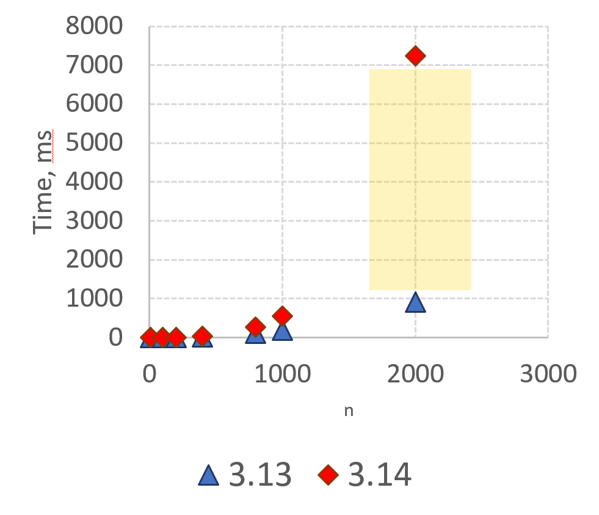

<!-- _class: lead keepcase -->
<!-- _paginate: false -->

# Monitoring Garbage Collector Events in Python

## Yesterday, today, tomorrow?

**Sergey Miryanov**
PyCon Russia 2026

---

<!-- Slide 2: two screenshots — GitHub cpython PRs (left), Python Developer's Guide (right) -->

## CPython contrиbutor

<div class="columns">
<div>


</div>
<div>


</div>
</div>

---

<!-- _class: lead -->

# What we'll talk about

---

<!-- _class: vcenter -->

- Memory management
- Garbage collection (GC, Garbage Collector, Garbage Collection)
- Garbage collection events

---

<!-- _class: divider -->

# Problem

<div class="roadmap">

- **Problem**
- Tools
- New API
- gcmon
- Perfetto
- Benchmarks
- Backports

</div>

---

<!-- Slide 6: RSS charts — 3.14 (left), 3.13 (right) -->

<div class="linkbar"><span class="hl">https://github.com/python/cpython/issues/142516</span></div>

<div class="columns center">
<div>

<span class="hl tag">3.14</span>


</div>
<div>

<span class="hl tag">3.13</span>


</div>
</div>

---

## Why does memory usage grow?

- A natural state?
- An internal leak?
- An external leak?
- A bug in the Python runtime/stdlib?
- A bug in the GC?

---

## What is a memory leak?

<div class="columns">
<div>

- Forgot to update the reference count
- Didn't free an unmanaged memory block
- Extended the object's lifetime
- The garbage collector didn't break cycles

</div>
<div class="diag8">
<div class="panel">


<span class="diaglabel">GC space</span>

</div>
<div class="panel">

<span class="diaglabel">object space</span>


</div>
<div class="panel memlayout">

<pre><code>gc_next
gc_prev

<span class="hlfield">ob_refcnt</span>
ob_type
...
...</code></pre>

<span class="diaglabel" style="text-align:right; display:block; white-space:nowrap;">memory layout</span>

</div>
</div>
</div>

---

## What is the GC responsible for?

<!-- _class: benchcode w430 -->

<div class="columns">
<div>

- Deduce unreachable objects
- Calls finalizers
- Handles weak references
- Breaks cycles
- *Deletes objects*

</div>
<div>

```python
def test(n=2000):
    d = {}
    for i in range(n):
        for j in range(n):
            d[(i,j)] = i
```



</div>
</div>

---

## What is the GC responsible for?

<!-- _class: benchcode w430 -->

<div class="columns">
<div>

- **3.14.0-3.14.4**
  - **Identifies live objects**
  - **Fills the increment**
- Deduce unreachable objects
- Calls finalizers
- Handles weak references
- Breaks cycles
- *Deletes objects*

<div class="qrnote">

<span class="qrcap">More details here <span class="arrow">→</span></span>


</div>

</div>
<div>

```python
def test(n=2000):
    d = {}
    for i in range(n):
        for j in range(n):
            d[(i,j)] = i
```


</div>
</div>

<!-- https://github.com/python/cpython/issues/142516 -->

---

<!-- Slide 11: RSS 3.14 chart (left) + trace/HTML-dump screenshot (right) -->

<div class="linkbar"><span class="hl">https://github.com/python/cpython/issues/142516</span></div>

<div class="columns center">
<div>

<span class="hl tag">3.14</span>


</div>
<div>


</div>
</div>

---

## GC storm

- Long/frequent pauses
- Increased memory/CPU usage
- Frequent full garbage collection


---

## GC storm

- Long/frequent pauses
- Increased memory/CPU usage
- Frequent full garbage collection


---

## Summary

- Causes of memory-usage growth
- What counts as a leak
- How reference counting works
- How the garbage collector works
- How the garbage collector affects the program
- What GC storm/thrashing is

---

<!-- _class: divider -->

# Tools

<div class="roadmap">

- Problem
- **Tools**
- New API
- gcmon
- Perfetto
- Benchmarks
- Backports

</div>

---

## Tools

<div class="columns">
<div>

- **In-process**
  - `tracemalloc`
  - `pympler`
  - APM (ddtrace, dynatrace, …)
- **Out-of-process**
  - `memray`
  - `austin`, `tachyon`
  - `pyroscope`, `perforator`

</div>
<div>

- CPU
- Allocations
- Snapshots
- Cycles
- Lifetime
- Leaks
- Number of GC pauses
- Number of collected objects

</div>
</div>

---

## The GC module

- **What's wrong with `gc.callbacks`**
  - Intrusive
  - C-&gt;Python interop
  - Subinterpreters
  - Heisenberg effect
- **What's wrong with `gc.get_stats`**
  - Intrusive
  - When
  - Subinterpreters

---

<!-- _class: divider -->

# New API

<div class="roadmap">

- Problem
- Tools
- **New API**
- gcmon
- Perfetto
- Benchmarks
- Backports

</div>

---

## GCMonitor

<div class="columns top">
<div class="box">

- _remote_debugging.get_gc_stats
- _remote_debugging.GCMonitor
  - init(pid)
  - get_gc_stats

</div>
<div class="box">

- External process
- Standard metrics
  - Collections
  - Collected
  - Uncollectable
  - *Candidates*
  - *Duration*
- *Number of live objects*
- Pause start and end time
- Subinterpreter support

</div>
</div>

---

## GCMonitor

<!-- _class: dense -->

<div class="columns">
<div>

```c {14,19}
struct pyruntimestate {
    /* This field must be first to facilitate locating it by out of process
     * debuggers. Out of process debuggers will use the offsets contained in
     * this field to be able to locate other fields in several interpreter
     * structures in a way that doesn't require them to know the exact layout
     * of those structures.
     *
     * IMPORTANT:
     * This struct is **NOT** backwards compatible between minor version of the
     * interpreter and the members, order of members and size can change
     * between minor versions. This struct is only guaranteed to be stable
     * between patch versions for a given minor version of the interpreter.
     */
    _Py_DebugOffsets debug_offsets;
    // ...
    struct pyinterpreters {
        PyMutex mutex;
        /* The linked list of interpreters, newest first. */
        PyInterpreterState *head;
        PyInterpreterState *main;
        int64_t next_id;
    } interpreters;
    // ...
};
```

</div>
<div>

```c {2,8,13,14}
typedef struct _Py_DebugOffsets {
    char cookie[8] _Py_NONSTRING;
    uint64_t version;
    uint64_t free_threaded;
    struct _runtime_state {
        uint64_t size;
        uint64_t finalizing;
        uint64_t interpreters_head;
    } runtime_state;
    struct _interpreter_state {
        uint64_t size;
        uint64_t id;
        uint64_t next;
        uint64_t gc;
        // ...
    } interpreter_state;
    struct _gc {
        uint64_t size;
        uint64_t collecting;
        uint64_t frame;
        uint64_t generation_stats_size;
        uint64_t generation_stats;
    } gc;
} _Py_DebugOffsets;
```

</div>
</div>

---

## GCMonitor

<!-- _class: hlcode -->

<div class="columns">
<div>

```c {2,8,13,14}
typedef struct _Py_DebugOffsets {
    char cookie[8] _Py_NONSTRING;
    uint64_t version;
    uint64_t free_threaded;
    struct _runtime_state {
        uint64_t size;
        uint64_t finalizing;
        uint64_t interpreters_head;
    } runtime_state;
    struct _interpreter_state {
        uint64_t size;
        uint64_t id;
        uint64_t next;
        uint64_t gc;
        // ...
    } interpreter_state;
    struct _gc {
        uint64_t size;
        uint64_t collecting;
        uint64_t frame;
        uint64_t generation_stats_size;
        uint64_t generation_stats;
    } gc;
} _Py_DebugOffsets;
```

</div>
<div>


</div>
</div>

---

## GC statistics

<!-- _class: hlcode -->

<div class="columns">
<div>

```c
struct gc_generation_stats {
    PyTime_t ts_start;
    PyTime_t ts_stop;
    Py_ssize_t collections;
    Py_ssize_t collected;
    Py_ssize_t uncollectable;
    Py_ssize_t candidates;
    double duration;
    Py_ssize_t heap_size;
};
struct gc_young_stats_buffer {
    struct gc_generation_stats items[11];
    int8_t index;
};
struct gc_old_stats_buffer {
    struct gc_generation_stats items[3];
    int8_t index;
};
struct gc_stats {
    struct gc_young_stats_buffer young;
    struct gc_old_stats_buffer old[2];
};
```

</div>
<div>


</div>
</div>

---

## Pauses

<!-- _class: frames -->

<div class="columns">
<div>

<div class="llistwrap">


</div>

</div>
<div>


</div>
</div>

---

## Pitfalls

- Non-Python processes
- Processes tree
- Race condition
  - Incomplete initialization
  - Partial read
- Elevated privileges
- GC storm/thrashing

---

## Summary

- Existing tools answer different questions
- Using the GC module distorts measurements
- The new API lets you look inside the GC without distortion
- The new API requires no pauses
- But there are pitfalls to keep in mind

---

<!-- _class: divider -->

# gcmon

<div class="roadmap">

- Problem
- Tools
- New API
- **gcmon**
- Perfetto
- Benchmarks
- Backports

</div>

---

## gcmon

<div class="columns">
<div>

- **Process management**
  - Child processes
  - Lifetime
  - Metadata
  - RSS
- **Extended metrics**
- **Export**
  - Various formats
- `pyperf` support
- Labels

</div>
<div>

- **Overhead**
  - Rate=100ms -&gt; 1%
  - Rate=10ms -&gt; 3-4%
- What about gcscope?

<div class="vgap"></div>

- Perfetto Binary Format
- Chrome Trace Format
- JSONL/stdout
- OpenTelemetry?

</div>
</div>

---

## gcmon

- **Standard metrics**
  - Collections
  - Collected
  - Uncollectable
  - *Candidates*
  - *Duration*
- *Number of live objects*
- Pause start and end time
- RSS

---

## gcmon

- **Debug data**
  - Mark Alive
  - Fill Increment
  - Deduce Unreachable
  - Handle Weakrefs Callbacks
  - Finalize Garbage
  - Handle Resurrected
  - Clear Weakrefs
  - Delete Garbage

---

<!-- _class: divider -->

# Perfetto

<div class="roadmap">

- Problem
- Tools
- New API
- gcmon
- **Perfetto**
- Benchmarks
- Backports

</div>

---

<!-- _class: overlay -->

<div class="shot">


<div class="corner br">

- Events/Slices
- Metrics
- Tracks
- Attributes
- Perfetto SQL

</div>

</div>

---

<!-- _class: overlay -->

<div class="shot">


<div class="corner bl">

- Process minimap
- Attributes
- Garbage collection phases

</div>

</div>

---

<!-- _class: overlay -->

<div class="shot">


<div class="corner br">

- Working with data
- Derived metrics
- SQLite+

</div>

</div>

---

<!-- _class: overlay -->

<div class="shot">


<div class="corner br">

- Derived metrics
- Binding to a timestamp

</div>

</div>

---

<!-- Slide 35: Perfetto SQL screenshot -->

<!-- _class: overlay -->

<div class="shot">


<div class="redbox"></div>

<div class="corner br">

- Additional tracks<br>for derived metrics

</div>

</div>

---

## Summary

- `gcmon` — an example of using the new API
- Lets you obtain additional information
- Uses Perfetto to store and visualize the data
- Perfetto can be used for your own purposes

---

<!-- _class: divider -->

# Benchmarks

<div class="roadmap">

- Problem
- Tools
- New API
- gcmon
- Perfetto
- **Benchmarks**
- Backports

</div>

---

## Benchmarks

- Why benchmarks?
- Pyperformance
- Cyclotron
- Any other

---

<!-- Slide 39: bar charts by generation -->

## Which generation dominates?

<div class="columns center">
<div>


</div>
<div>


</div>
</div>

---

<!-- Slide 40: GC Pause composition by generation -->

## Typical phase distribution


---

<!-- Slide 41: fastapi_http — phase/duration distribution -->

## Many objects with "heavy" data


---

<!-- Slide 42: docutils — phase/duration distribution -->

## Finalizers


---

## Summary

- `gcmon` / the new API
  - can be used to profile production systems
  - can be used to analyze garbage collector behavior
- You can obtain information about possible tuning of production systems

---

<!-- _class: divider -->

# Backports

<div class="roadmap">

- Problem
- Tools
- New API
- gcmon
- Perfetto
- Benchmarks
- **Backports**

</div>

---

## 3.13-3.14

<!-- _class: wcode -->

<div class="columns">
<div>

```c {2,8,13,14,19}
typedef struct _Py_DebugOffsets {
    char cookie[8] _Py_NONSTRING;
    uint64_t version;
    uint64_t free_threaded;
    struct _runtime_state {
        uint64_t size;
        uint64_t finalizing;
        uint64_t interpreters_head;
    } runtime_state;
    struct _interpreter_state {
        uint64_t size;
        uint64_t id;
        uint64_t next;
        uint64_t gc;
        // ...
    } interpreter_state;
    struct _gc {
        uint64_t size;
        uint64_t collecting;
    } gc;
} _Py_DebugOffsets;
```

</div>
<div>

```c
/* Running stats per generation */
struct gc_generation_stats {
    Py_ssize_t collections;
    Py_ssize_t collected;
    Py_ssize_t uncollectable;
};
```

```c {12,14}
struct _gc_runtime_state {
    PyObject *trash_delete_later;
    int trash_delete_nesting;
    /* Is automatic collection enabled? */
    int enabled;
    int debug;
    /* linked lists of container objects */
    struct gc_generation generations[NUM_GENERATIONS];
    PyGC_Head *generation0;
    /* a permanent generation which won't be collected */
    struct gc_generation permanent_generation;
    struct gc_generation_stats generation_stats[NUM_GENERATIONS];
    /* true if we are currently running the collector */
    int collecting;
    /* list of uncollectable objects */
    PyObject *garbage;
    /* a list of callbacks to be invoked when collection is performed */
    PyObject *callbacks;
};
```

</div>
</div>

---

<!-- Slide 46: two terminal screenshots (3.13-3.14) -->

## 3.13-3.14

<div class="columns center">
<div>

<div class="imgwrap"><span class="imglabel">_Py_DebugOffsets</span></div>

</div>
<div>

<div class="imgwrap"><span class="imglabel">GC Stats Buffer</span></div>

</div>
</div>

---

<!-- Slide 47: two terminal screenshots (3.13-3.14) -->

## 3.13-3.14

<div class="columns center">
<div>

<div class="imgwrap"><span class="imglabel">3.14</span></div>

</div>
<div>

<div class="imgwrap"><span class="imglabel">3.15+</span></div>

</div>
</div>

---

## 3.8, 3.9-3.10, 3.11-3.12

<div class="columns">
<div>

- What if there's no marker, nothing at all — what do we do?
- How stable is it?
- What factors can affect it?
- How do we validate it?

</div>
<div>

<div class="imgwrap"><span class="imglabel">3.8</span></div>

</div>
</div>

---

<!-- _class: lead -->

# Call to action

---

<!-- _class: vcenter -->

- Which metrics are interesting and/or necessary for you?
- In what scenarios would you use these capabilities?
- Which formats and integrations interest you?
- What is your environment?
- What alerts do you envision?

**Where to reach us:**

- [gcmon/issues](https://github.com/sergey-miryanov/gcmon/issues)
- [discuss.python.org](https://discuss.python.org/)
- [CPython/issues](https://github.com/python/cpython/issues)

---

<!-- _class: lead -->
<!-- _paginate: false -->

# Thank you for your attention!

email: sergey.miryanov@gmail.com
