<!-- _class: lead keepcase -->
<!-- _paginate: false -->

# Мониторинг событий сборщика мусора в Python

## Вчера, сегодня, завтра?

**Мирянов Сергей**
PyCon Russia 2026

---

<!-- Слайд 2: два скриншота — слева GitHub cpython PRs, справа Python Developer's Guide -->

## CPython контрnбьютор

<div class="columns">
<div>

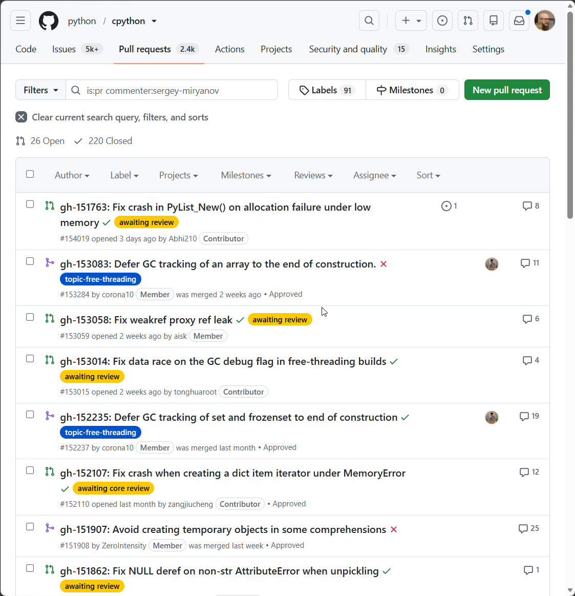

</div>
<div>

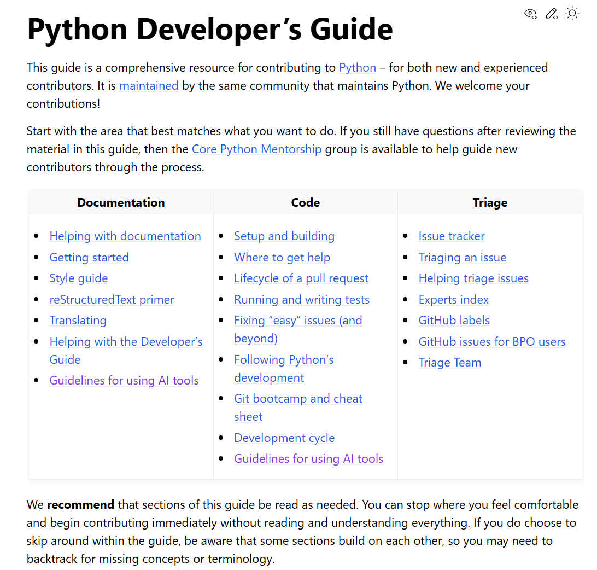

</div>
</div>

---

<!-- _class: lead -->

# О чём будем говорить

---

<!-- _class: vcenter -->

- Управление памятью
- Сборка мусора (GC, Garbage Collector, Garbage Collection)
- События сборки мусора

---

<!-- _class: divider -->

# Проблема

<div class="roadmap">

- **Проблема**
- Инструменты
- Новое API
- gcmon
- Perfetto
- Бенчмарки
- Backports

</div>

---

<!-- Слайд 6: RSS-графики — слева 3.14, справа 3.13 -->

<div class="linkbar"><span class="hl">https://github.com/python/cpython/issues/142516</span></div>

<div class="columns center">
<div>

<span class="hl tag">3.14</span>

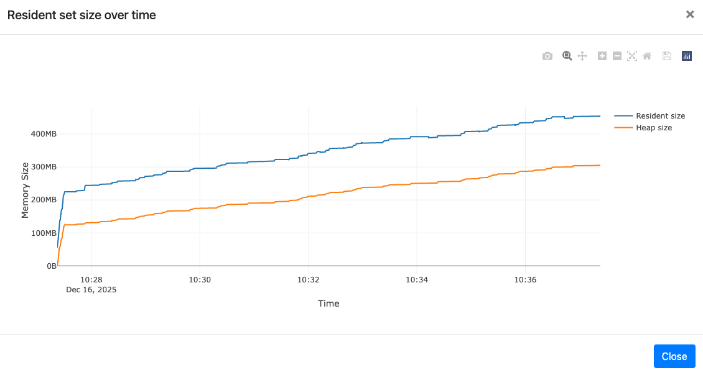

</div>
<div>

<span class="hl tag">3.13</span>

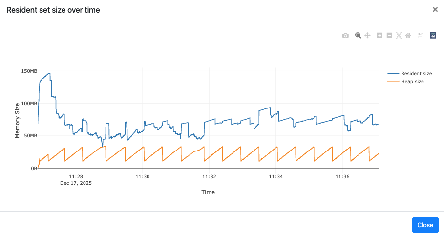

</div>
</div>

---

## Почему потребление памяти растёт?

- Естественное состояние?
- Внутренняя утечка?
- Внешняя утечка?
- Ошибка в Python runtime/stdlib?
- Ошибка в GC?

---

## Что такое утечка памяти?

<div class="columns">
<div>

- Забыли обновить счётчик ссылок
- Не освободили неуправляемый блок памяти
- Продлили время жизни
- Сборщик мусора не разорвал циклы

</div>
<div class="diag8">
<div class="panel">


<span class="diaglabel">GC space</span>

</div>
<div class="panel">

<span class="diaglabel">object space</span>

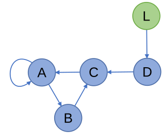

</div>
<div class="panel memlayout">

<pre><code>gc_next
gc_prev

<span class="hlfield">ob_refcnt</span>
ob_type
...
...</code></pre>

<span class="diaglabel" style="text-align:right; display:block; white-space:nowrap;">memory layout</span>

</div>
</div>
</div>

---

## За что отвечает GC?

<!-- _class: benchcode w430 -->

<div class="columns">
<div>

- Определяет недостижимые объекты
- Вызывает финализаторы
- Обрабатывает слабые ссылки
- Разрывает циклы
- *Удаляет объекты*

</div>
<div>

```python
def test(n=2000):
    d = {}
    for i in range(n):
        for j in range(n):
            d[(i,j)] = i
```

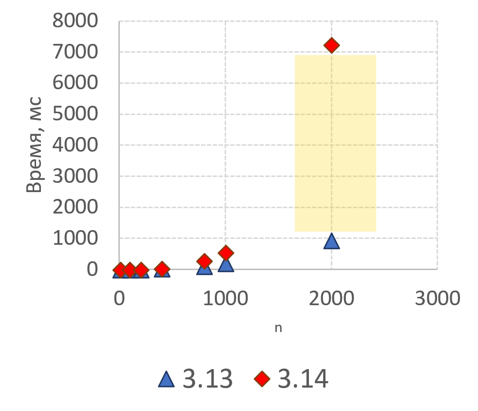

</div>
</div>

---

## За что отвечает GC?

<!-- _class: benchcode w430 -->

<div class="columns">
<div>

- **3.14.0-3.14.4**
  - **Определяет живые объекты**
  - **Формирует инкремент**
- Определяет недостижимые объекты
- Вызывает финализаторы
- Обрабатывает слабые ссылки
- Разрывает циклы
- *Удаляет объекты*

<div class="qrnote">

<span class="qrcap">Подробнее здесь <span class="arrow">→</span></span>


</div>

</div>
<div>

```python
def test(n=2000):
    d = {}
    for i in range(n):
        for j in range(n):
            d[(i,j)] = i
```


</div>
</div>

<!-- https://github.com/python/cpython/issues/142516 -->

---

<!-- Слайд 11: график RSS 3.14 (слева) + скриншот трейса/HTML-дампа (справа) -->

<div class="linkbar"><span class="hl">https://github.com/python/cpython/issues/142516</span></div>

<div class="columns center">
<div>

<span class="hl tag">3.14</span>


</div>
<div>

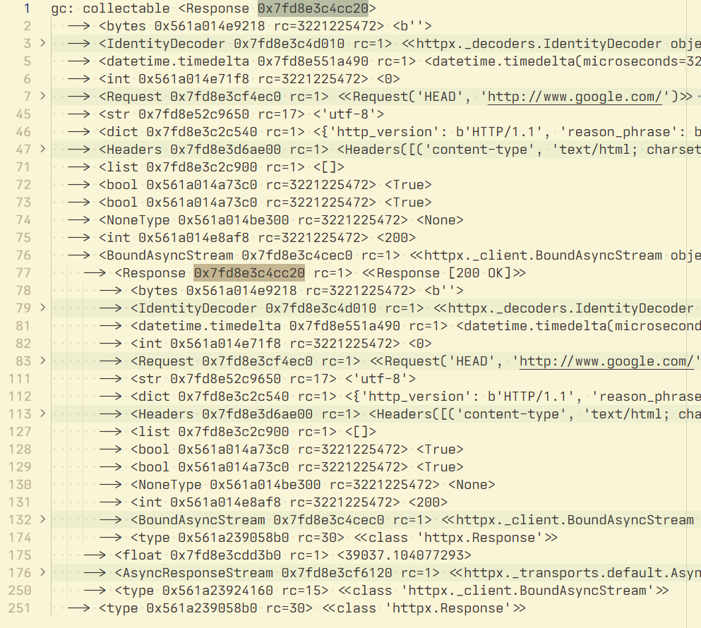

</div>
</div>

---

## GC storm

- Длинные/частые паузы
- Повышенное потребление памяти/CPU
- Частая полная сборка мусора

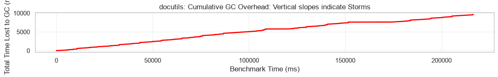

---

## GC storm

- Длинные/частые паузы
- Повышенное потребление памяти/CPU
- Частая полная сборка мусора

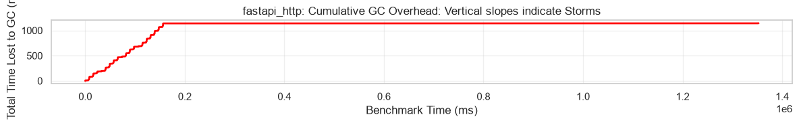

---

## Резюме

- Причины роста потребления памяти
- Что является утечкой
- Как работает подсчёт ссылок
- Как работает сборщик мусора
- Как влияет сборщик мусора на программу
- Что такое GC storm/thrashing

---

<!-- _class: divider -->

# Инструменты

<div class="roadmap">

- Проблема
- **Инструменты**
- Новое API
- gcmon
- Perfetto
- Бенчмарки
- Backports

</div>

---

## Инструменты

<div class="columns">
<div>

- **In-process**
  - `tracemalloc`
  - `pympler`
  - APM (ddtrace, dynatrace, …)
- **Out-of-process**
  - `memray`
  - `austin`, `tachyon`
  - `pyroscope`, `perforator`

</div>
<div>

- CPU
- Аллокации
- Снепшоты
- Циклы
- Время жизни
- Утечки
- Количество GC пауз
- Количество собранных объектов

</div>
</div>

---

## Модуль GC

- **Что не так с `gc.callbacks`**
  - Intrusive
  - C-&gt;Python interop
  - Сабинтерпретаторы
  - Heisenberg effect
- **Что не так с `gc.get_stats`**
  - Intrusive
  - When
  - Сабинтерпретаторы

---

<!-- _class: divider -->

# Новое API

<div class="roadmap">

- Проблема
- Инструменты
- **Новое API**
- gcmon
- Perfetto
- Бенчмарки
- Backports

</div>

---

## GCMonitor

<div class="columns top">
<div class="box">

- _remote_debugging.get_gc_stats
- _remote_debugging.GCMonitor
  - init(pid)
  - get_gc_stats

</div>
<div class="box">

- Внешний процесс
- Стандартные метрики
  - Collections
  - Collected
  - Uncollectable
  - *Candidates*
  - *Duration*
- *Количество живых объектов*
- Время начала и окончания паузы
- Поддержка сабинтерпретаторов

</div>
</div>

---

## GCMonitor

<!-- _class: dense -->

<div class="columns">
<div>

```c {14,19}
struct pyruntimestate {
    /* This field must be first to facilitate locating it by out of process
     * debuggers. Out of process debuggers will use the offsets contained in
     * this field to be able to locate other fields in several interpreter
     * structures in a way that doesn't require them to know the exact layout
     * of those structures.
     *
     * IMPORTANT:
     * This struct is **NOT** backwards compatible between minor version of the
     * interpreter and the members, order of members and size can change
     * between minor versions. This struct is only guaranteed to be stable
     * between patch versions for a given minor version of the interpreter.
     */
    _Py_DebugOffsets debug_offsets;
    // ...
    struct pyinterpreters {
        PyMutex mutex;
        /* The linked list of interpreters, newest first. */
        PyInterpreterState *head;
        PyInterpreterState *main;
        int64_t next_id;
    } interpreters;
    // ...
};
```

</div>
<div>

```c {2,8,13,14}
typedef struct _Py_DebugOffsets {
    char cookie[8] _Py_NONSTRING;
    uint64_t version;
    uint64_t free_threaded;
    struct _runtime_state {
        uint64_t size;
        uint64_t finalizing;
        uint64_t interpreters_head;
    } runtime_state;
    struct _interpreter_state {
        uint64_t size;
        uint64_t id;
        uint64_t next;
        uint64_t gc;
        // ...
    } interpreter_state;
    struct _gc {
        uint64_t size;
        uint64_t collecting;
        uint64_t frame;
        uint64_t generation_stats_size;
        uint64_t generation_stats;
    } gc;
} _Py_DebugOffsets;
```

</div>
</div>

---

## GCMonitor

<!-- _class: hlcode -->

<div class="columns">
<div>

```c {2,8,13,14}
typedef struct _Py_DebugOffsets {
    char cookie[8] _Py_NONSTRING;
    uint64_t version;
    uint64_t free_threaded;
    struct _runtime_state {
        uint64_t size;
        uint64_t finalizing;
        uint64_t interpreters_head;
    } runtime_state;
    struct _interpreter_state {
        uint64_t size;
        uint64_t id;
        uint64_t next;
        uint64_t gc;
        // ...
    } interpreter_state;
    struct _gc {
        uint64_t size;
        uint64_t collecting;
        uint64_t frame;
        uint64_t generation_stats_size;
        uint64_t generation_stats;
    } gc;
} _Py_DebugOffsets;
```

</div>
<div>

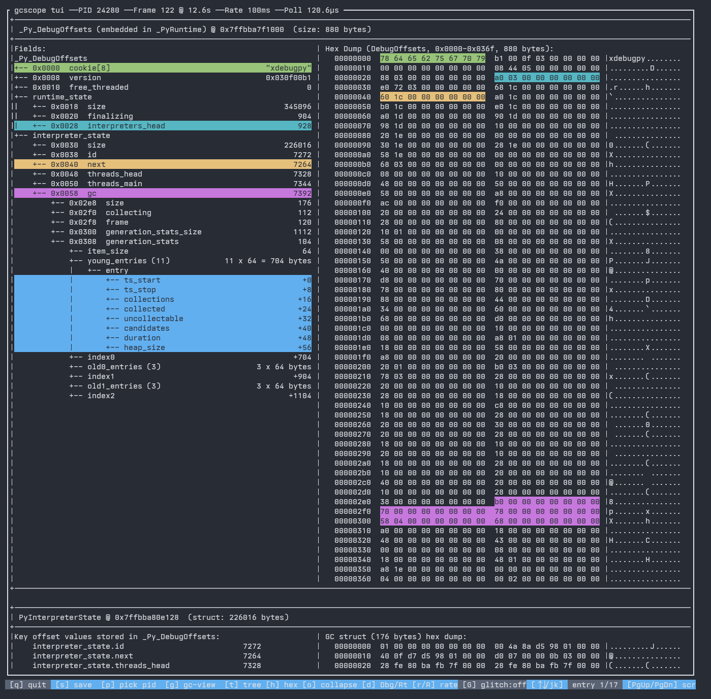

</div>
</div>

---

## GC статистика

<!-- _class: hlcode -->

<div class="columns">
<div>

```c
struct gc_generation_stats {
    PyTime_t ts_start;
    PyTime_t ts_stop;
    Py_ssize_t collections;
    Py_ssize_t collected;
    Py_ssize_t uncollectable;
    Py_ssize_t candidates;
    double duration;
    Py_ssize_t heap_size;
};
struct gc_young_stats_buffer {
    struct gc_generation_stats items[11];
    int8_t index;
};
struct gc_old_stats_buffer {
    struct gc_generation_stats items[3];
    int8_t index;
};
struct gc_stats {
    struct gc_young_stats_buffer young;
    struct gc_old_stats_buffer old[2];
};
```

</div>
<div>

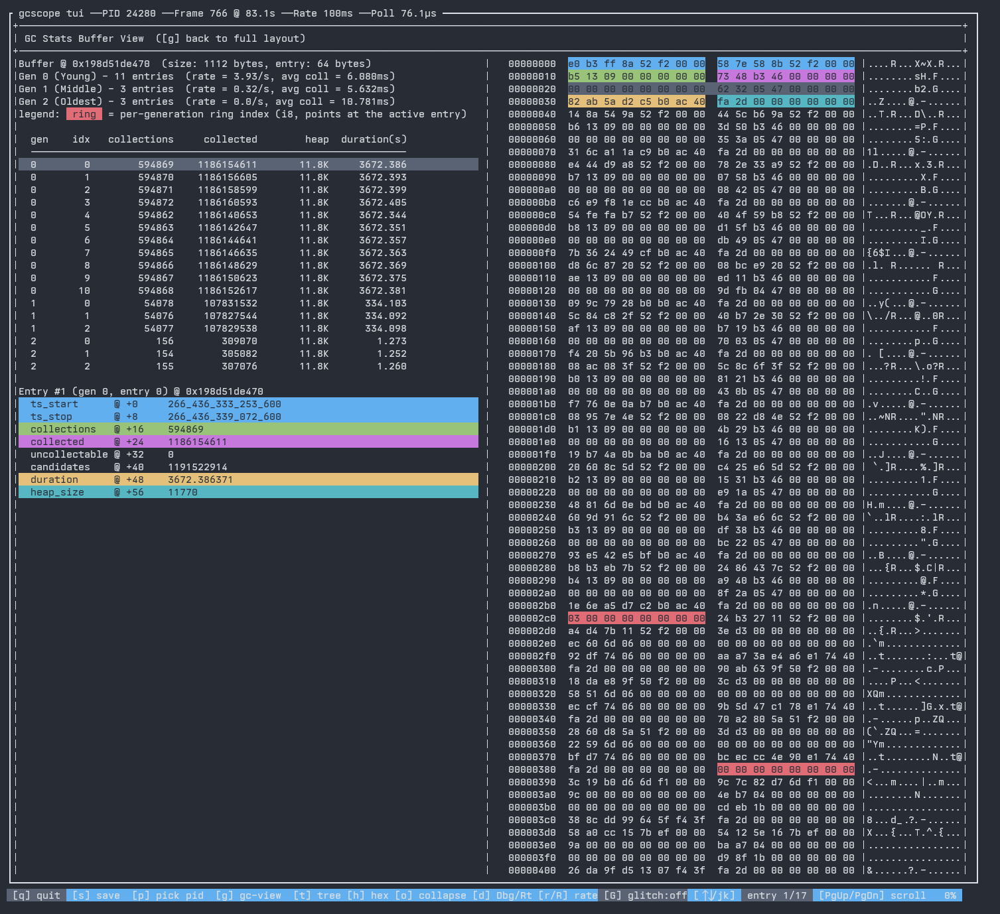

</div>
</div>

---

## Паузы

<!-- _class: frames -->

<div class="columns">
<div>

<div class="llistwrap">

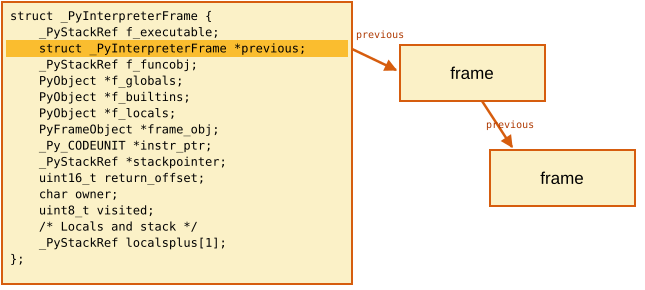

</div>

</div>
<div>


</div>
</div>

---

## Подводные камни

- Не-питоновские процессы
- Дочерние процессы
- Состояние гонки
  - Не полная инициализация
  - Частичное чтение
- Повышенные права
- GC storm/thrashing

---

## Резюме

- Существующие инструменты отвечают на другие вопросы
- Использование модуля GC вносит искажения в замеры
- Новое API позволяет заглянуть внутрь GC и не вносит искажений
- Новое API не требует пауз
- Но есть подводные камни, которые надо учитывать

---

<!-- _class: divider -->

# gcmon

<div class="roadmap">

- Проблема
- Инструменты
- Новое API
- **gcmon**
- Perfetto
- Бенчмарки
- Backports

</div>

---

## gcmon

<div class="columns">
<div>

- **Управление процессами**
  - Дочерние процессы
  - Время жизни
  - Метаданные
  - RSS
- **Расширенные метрики**
- **Экспорт**
  - Разные форматы
- Поддержка `pyperf`
- Метки

</div>
<div>

- **Оверхед**
  - Rate=100ms -&gt; 1%
  - Rate=10ms -&gt; 3-4%
- А что с gcscope?

<div class="vgap"></div>

- Perfetto Binary Format
- Chrome Trace Format
- JSONL/stdout
- OpenTelemetry?

</div>
</div>

---

## gcmon

- **Стандартные метрики**
  - Collections
  - Collected
  - Uncollectable
  - *Candidates*
  - *Duration*
- *Количество живых объектов*
- Время начала и окончания паузы
- RSS

---

## gcmon

- **Отладочные данные**
  - Mark Alive
  - Fill Increment
  - Deduce Unreachable
  - Handle Weakrefs Callbacks
  - Finalize Garbage
  - Handle Resurrected
  - Clear Weakrefs
  - Delete Garbage

---

<!-- _class: divider -->

# Perfetto

<div class="roadmap">

- Проблема
- Инструменты
- Новое API
- gcmon
- **Perfetto**
- Бенчмарки
- Backports

</div>

---

<!-- _class: overlay -->

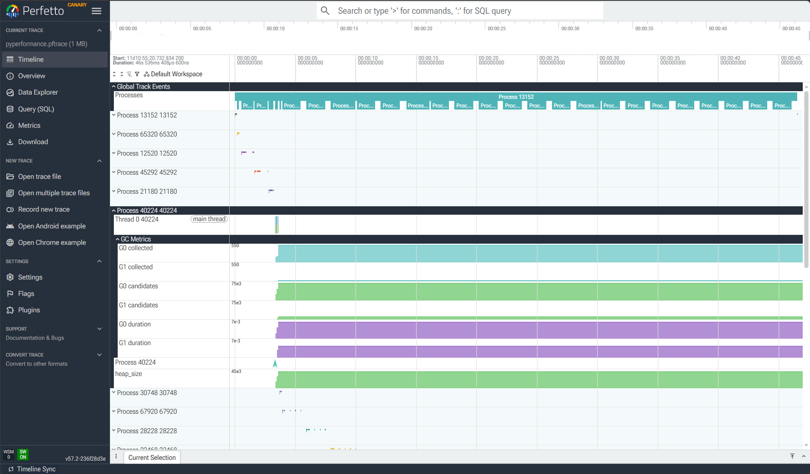

<div class="corner br">

- События/Слайсы
- Метрики
- Треки
- Атрибуты
- Perfetto SQL

</div>

---

<!-- _class: overlay -->

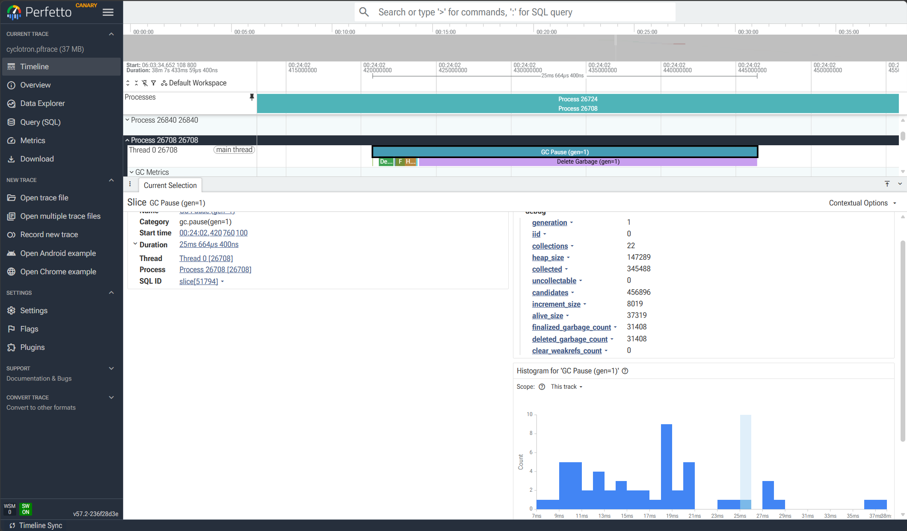

<div class="corner bl">

- Мини-карта процессов
- Атрибуты
- Фазы сборки мусора

</div>

---

<!-- _class: overlay -->

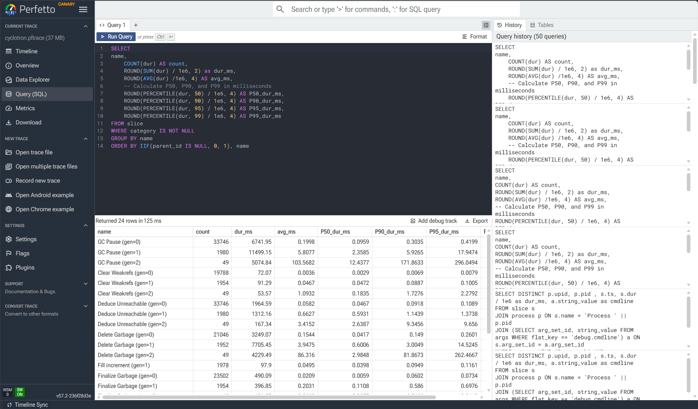

<div class="corner br">

- Работа с данными
- Производные метрики
- SQLite+

</div>

---

<!-- _class: overlay -->

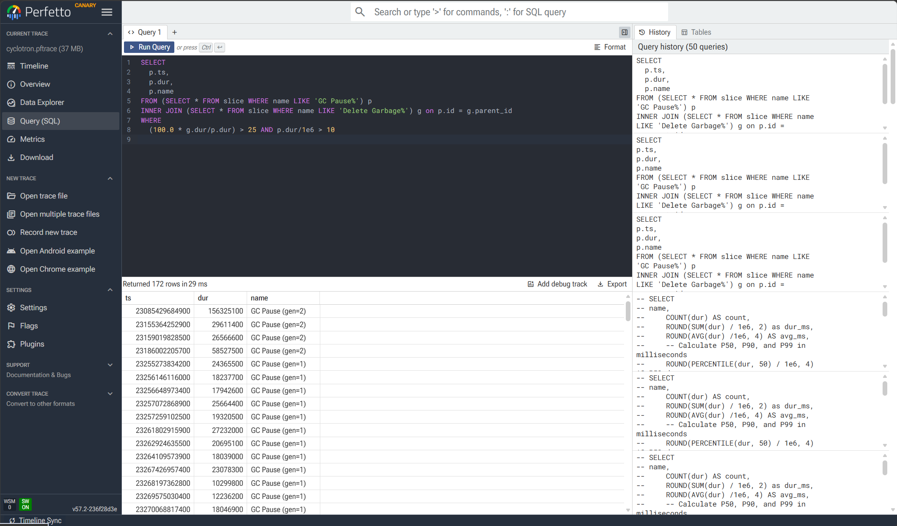

<div class="corner br">

- Производные метрики
- Привязка к timestamp

</div>

---

<!-- Слайд 35: скриншот Perfetto SQL -->

<!-- _class: overlay -->

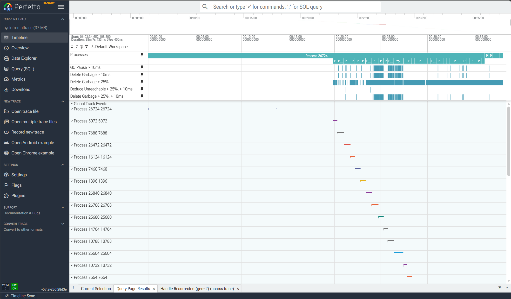

<div class="redbox"></div>

<div class="corner br">

- Дополнительные треки<br>для производных метрик

</div>

---

## Резюме

- `gcmon` — пример использования нового API
- Позволяет получить дополнительную информацию
- Использует Perfetto для хранения и визуализации данных
- Perfetto можно использовать для своих целей

---

<!-- _class: divider -->

# Бенчмарки

<div class="roadmap">

- Проблема
- Инструменты
- Новое API
- gcmon
- Perfetto
- **Бенчмарки**
- Backports

</div>

---

## Бенчмарки

- Почему бенчмарки?
- Pyperformance
- Cyclotron
- Any other

---

<!-- Слайд 39: столбчатые диаграммы по поколениям -->

## Какое поколение преобладает?

<div class="columns center">
<div>

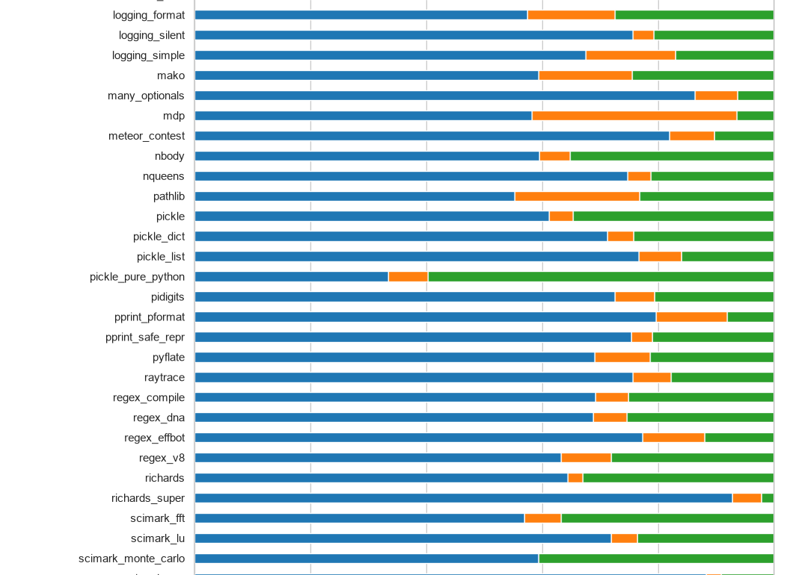

</div>
<div>

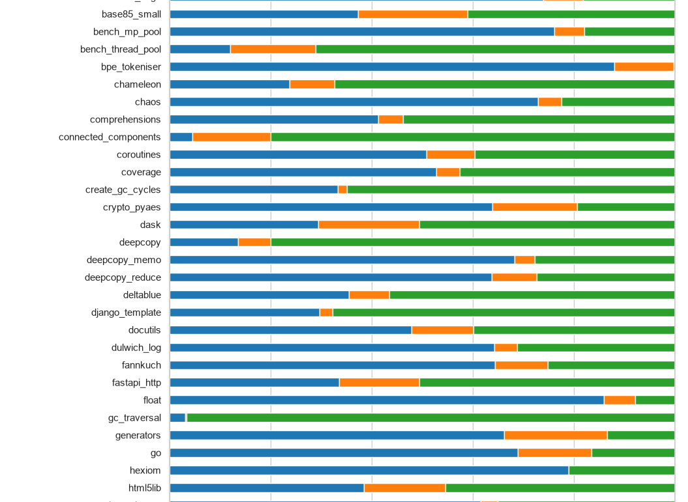

</div>
</div>

---

<!-- Слайд 40: GC Pause composition by generation -->

## Типичное распределение фаз

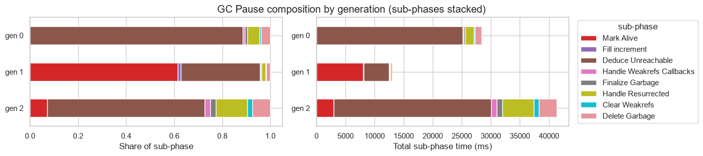

---

<!-- Слайд 41: fastapi_http — распределение фаз/длительностей -->

## Много объектов с «тяжёлыми» данными

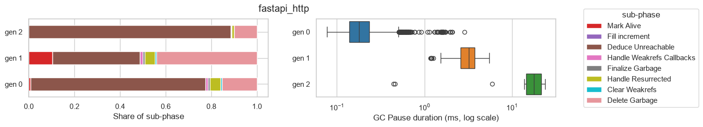

---

<!-- Слайд 42: docutils — распределение фаз/длительностей -->

## Финализаторы

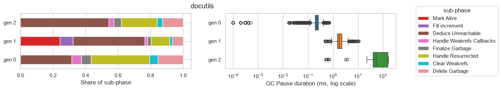

---

## Резюме

- `gcmon` / новое API
  - можно использовать для профилирования продуктивных систем
  - можно использовать для анализа работы сборщика мусора
- Можно получить информацию о возможном тюнинге продуктивных систем

---

<!-- _class: divider -->

# Backports

<div class="roadmap">

- Проблема
- Инструменты
- Новое API
- gcmon
- Perfetto
- Бенчмарки
- **Backports**

</div>

---

## 3.13-3.14

<!-- _class: wcode -->

<div class="columns">
<div>

```c {2,9,15,16,21}
typedef struct _Py_DebugOffsets {
    char cookie[8] _Py_NONSTRING;
    uint64_t version;
    uint64_t free_threaded;
    // Runtime state offset;
    struct _runtime_state {
        uint64_t size;
        uint64_t finalizing;
        uint64_t interpreters_head;
    } runtime_state;
    // Interpreter state offset;
    struct _interpreter_state {
        uint64_t size;
        uint64_t id;
        uint64_t next;
        uint64_t gc;
        // ...
    } interpreter_state;
    struct _gc {
        uint64_t size;
        uint64_t collecting;
    } gc;
} _Py_DebugOffsets;
```

</div>
<div>

```c
/* Running stats per generation */
struct gc_generation_stats {
    Py_ssize_t collections;
    Py_ssize_t collected;
    Py_ssize_t uncollectable;
};
```

```c {12,14}
struct _gc_runtime_state {
    PyObject *trash_delete_later;
    int trash_delete_nesting;
    /* Is automatic collection enabled? */
    int enabled;
    int debug;
    /* linked lists of container objects */
    struct gc_generation generations[NUM_GENERATIONS];
    PyGC_Head *generation0;
    /* a permanent generation which won't be collected */
    struct gc_generation permanent_generation;
    struct gc_generation_stats generation_stats[NUM_GENERATIONS];
    /* true if we are currently running the collector */
    int collecting;
    /* list of uncollectable objects */
    PyObject *garbage;
    /* a list of callbacks to be invoked when collection is performed */
    PyObject *callbacks;
};
```

</div>
</div>

---

<!-- Слайд 46: два скриншота терминала (3.13-3.14) -->

## 3.13-3.14

<div class="columns center">
<div>

<div class="imgwrap">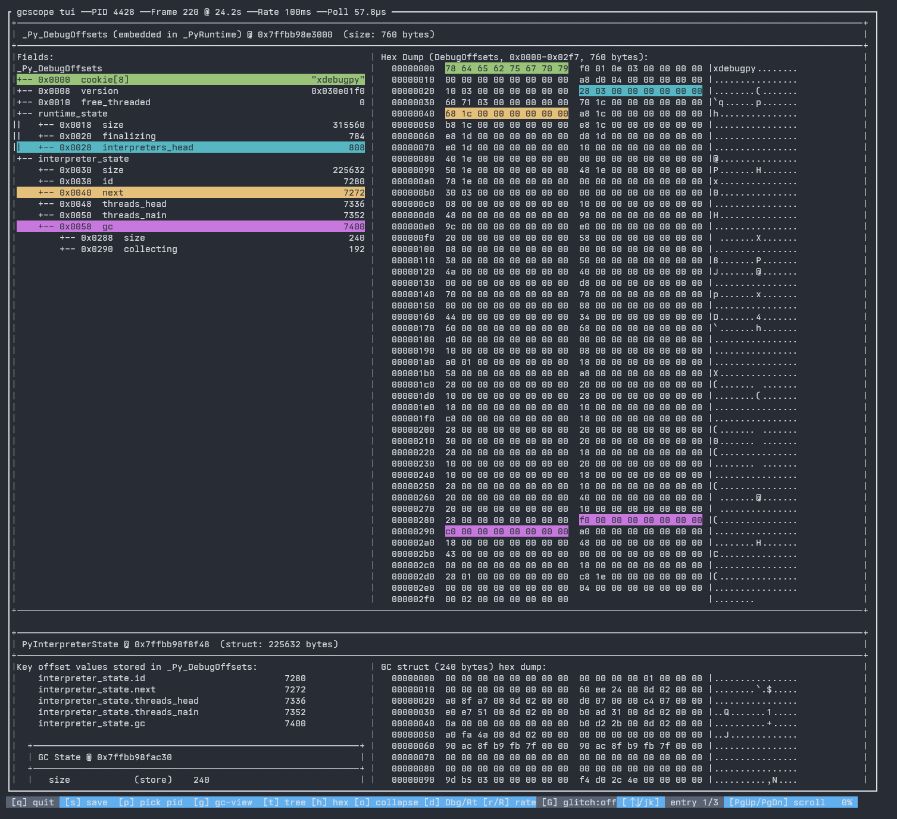<span class="imglabel">_Py_DebugOffsets</span></div>

</div>
<div>

<div class="imgwrap">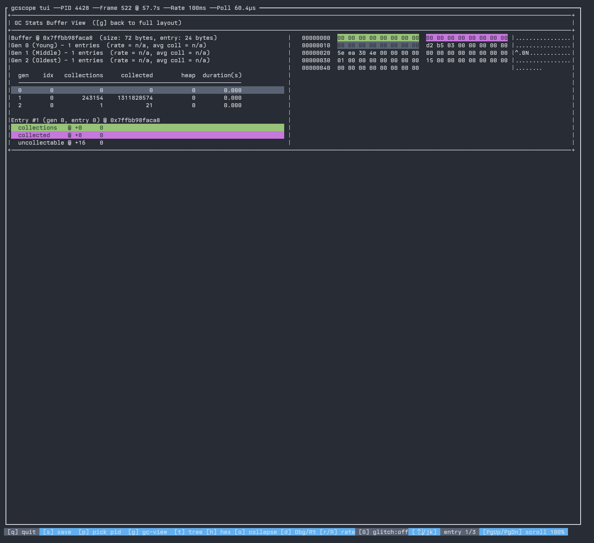<span class="imglabel">GC Stats Buffer</span></div>

</div>
</div>

---

<!-- Слайд 47: два скриншота терминала (3.13-3.14) -->

## 3.13-3.14

<div class="columns center">
<div>

<div class="imgwrap"><span class="imglabel">3.14</span></div>

</div>
<div>

<div class="imgwrap"><span class="imglabel">3.15+</span></div>

</div>
</div>

---

## 3.8, 3.9-3.10, 3.11-3.12

<div class="columns">
<div>

- А если маркера нет, ничего нет, что делать?
- Насколько это стабильно?
- Какие факторы могут повлиять?
- Как это валидировать?

</div>
<div>

<div class="imgwrap">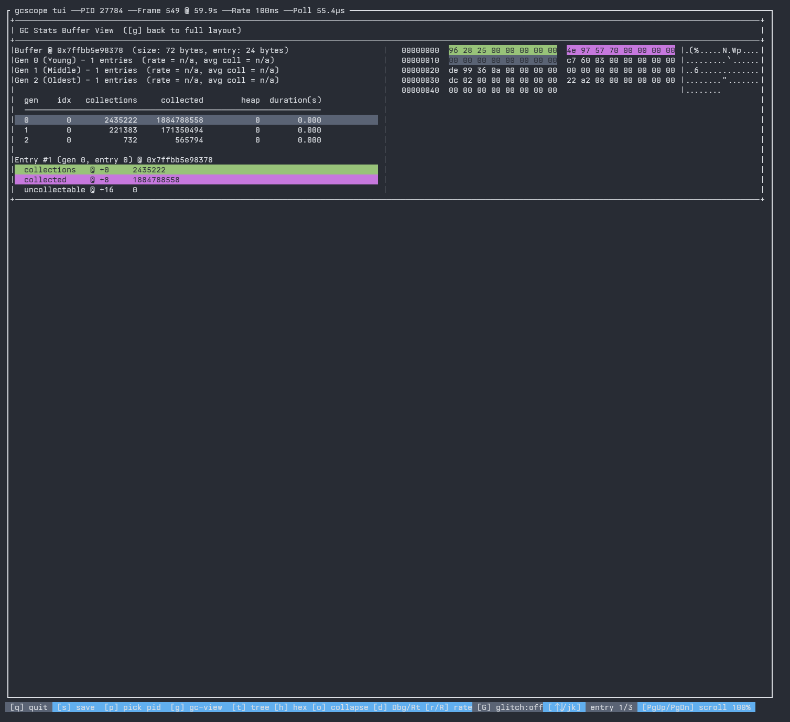<span class="imglabel">3.8</span></div>

</div>
</div>

---

<!-- _class: lead -->

# Call to action

---

<!-- _class: vcenter -->

- Какие метрики вам интересны и/или необходимы?
- В каких сценариях вы бы использовали эти возможности?
- Какие форматы и интеграции вам интересны?
- Какое ваше окружение?
- Какие алерты вы видите?

**Куда писать:**

- [gcmon/issues](https://github.com/sergey-miryanov/gcmon/issues)
- [discuss.python.org](https://discuss.python.org/)
- [CPython/issues](https://github.com/python/cpython/issues)

---

<!-- _class: lead -->
<!-- _paginate: false -->

# Спасибо за внимание!

email: sergey.miryanov@gmail.com
